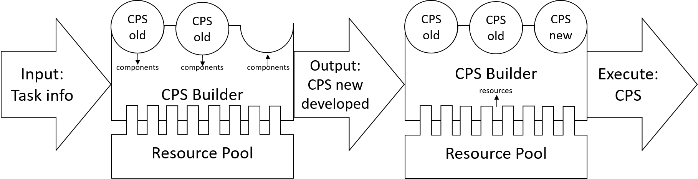
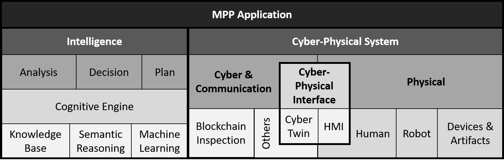
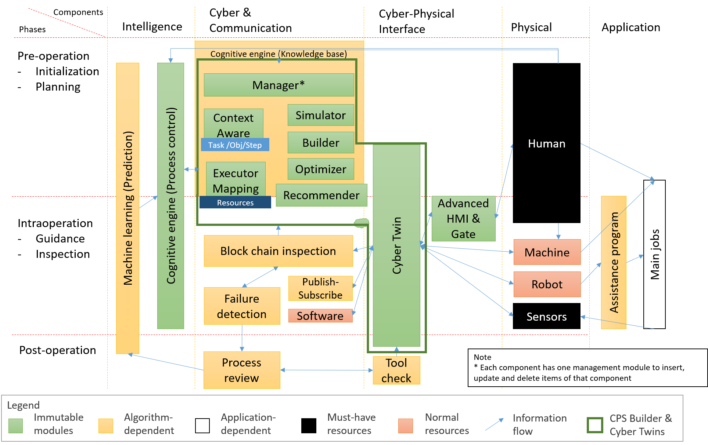

# IntelligentCPS
This is a project of NUS Control & Mechatronics Lab under guidance of Prof. Chui Chee Kong. This project contains a cyber-physical system (CPS) Builder that consolidates CPS components into an ad-hoc system.

This Builder is meant to be executed with a cognitive engine process controller (IntelligentCPS-CE) and Cyber Twin (IntelligentCPS-CT).
The focused application of this system is for Mass Personalized Production (MPP) as part of a contribution to Industrial 4.0.

> Note:
> * [IntelligentCPS-CE](https://github.com/mpecck/IntelligentCPS_CE) and [IntelligentCPS-CT](https://github.com/mpecck/IntelligentCPS_CT) were another repositories built by the same research group.
> * Information on the research group can be found in http://blog.nus.edu.sg/mpecck/.
> * More documentation details on this repository can be found [here](https://github.com/mpecck/IntelligentCPS/tree/feature/documentation/doc) .


## 1. Overview
The figure below shows the level-zero architecture of this project.

The novelty in this project is to emphasize the importance of intelligence in a CPS. The intelligence components have to be capable of performing analysis, making decision and planning processes.
Components in a CPS is categorized into cyber and communication, cyber-physical interface and physical classes. Elaborations on these components is provided in the next section.
This project stems from the big picture that is depicted below. The motto of this project is to support human-centered CPS with the idea that systems are meant to assist humans and not to replace humans.

The application of this gigantic system is to plan, develop, run and analyze operational processes. An operation is broken down into three phases: Pre-operation, Intra-operation and Post-operation.


## 2. IntelligentCPS Components
This project is under the umbrella of the IntelligentCPS project. The processes and resources are encapsulated in the following manner.

1. The component ```step``` refers to the lowest level of instruction for the process.
2. The component ``` task``` refers to the highest level of instruction for the process. For example, "Fabricate product A" is a task.
3. The component ``` objective``` refers to the instruction that is between ```step``` and ```task```. This can be broken down into multiple layers. Among them, the lowest layer is ```objective_layer_1```.
4. Executors of a job execution depends on the resources within the assigned location.

> Note:
> * A job ties multiple ```task``` components in an unordered manner as a single job submission.
> * An executor is a resource assigned to execute a step.
> * Execution is done at the lowest level, which is at the step layer.


## 3. Features
1. This CPS Builder provides a user-interface to plan and initiate components to be used in the developing CPS.
The front end is implemented with Python with Flask and Bootstrap being used as the framework for the web-application.
2. CPS configured is user-specific, meaning an account has to be registered to enter the service.
3. The components that are not configured completely can be saved as drafts.
4. Alternatively, the process components can be roughly designed in an excel sheet (template provided in ```example_onto.xlxs```) and then imported into the CPS Builder. Fine tuning of the configured is required after the import.
5. This CPS Builder allows checking availability and status of resources in a centralized manner.
6. Configured components can be used to build jobs to be executed by available resources.


## 4. Pre-Installation Check
1. This project was developed using [Pycharm IDE](https://www.jetbrains.com/pycharm/download/#section=windows) in [Python 3.6 x64 bit](https://www.python.org/downloads/release/python-366/) environment.
Ensure that the following programs are installed:
2. The lists of python packages required (with version number included) are documented in requirements.txt.
3. MongoDB is required to act as a buffer for data transfer and as a database for process status updates. To install on your system, follow the instructions provided on [MongoDB website](https://docs.mongodb.com/manual/installation/).
[MongoDB Compass](https://www.mongodb.com/download-center/compass) is a GUI for the database. When the installation is completed, ensure that the database and collections specified [here](https://github.com/mpecck/IntelligentCPS/blob/feature/documentation/doc/data_schema.md) are created.
4. The cyber twin is developed in a separate repository [IntelligentCPS_CT](https://github.com/mpecck/IntelligentCPS_CT) . Installation guide can be found in that repository.
5. During the intra-operation phase, operational processes are controlled by [IntelligentCPS_CE](https://github.com/mpecck/IntelligentCPS_CE) . Installation guide can be found in that repository.
6. Optional: [Postman](https://www.getpostman.com/downloads/) can be used to test RestAPI development.


## 5. Installation in Windows
1. Clone this repository using [Git](https://git-scm.com/) or download this repository.
2. Create new new virtual environment for the project.
3. Install packages into the virtual environment from requirements.txt.
4. Duplicate the ```config_template.py``` file and rename the duplicate ```config.py```. This will serve as the config file for the application.
5. Edit the values in ```config.py``` accordingly.


## 6. Run
1. Run the Flask server from ```run.py```.
2. The Flask server should be running at http://localhost:5000 .

