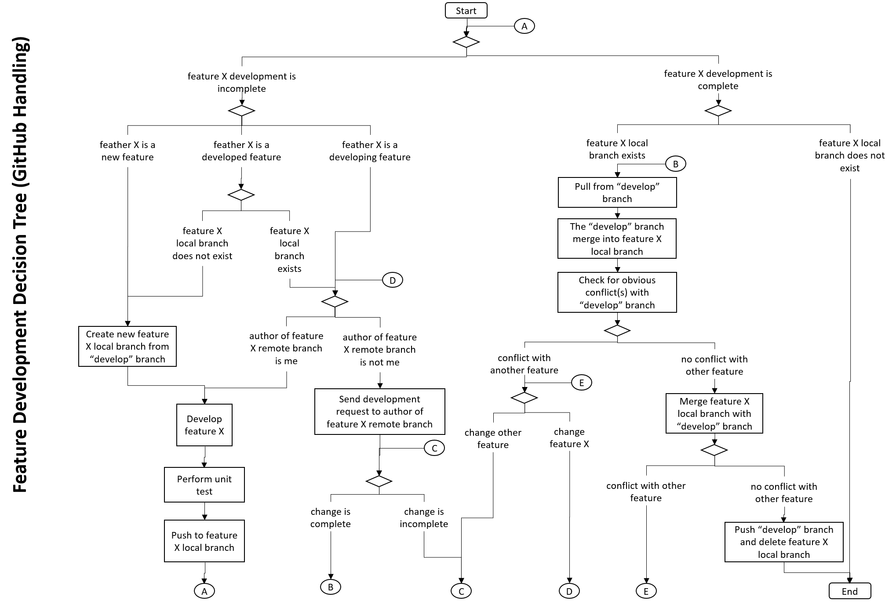
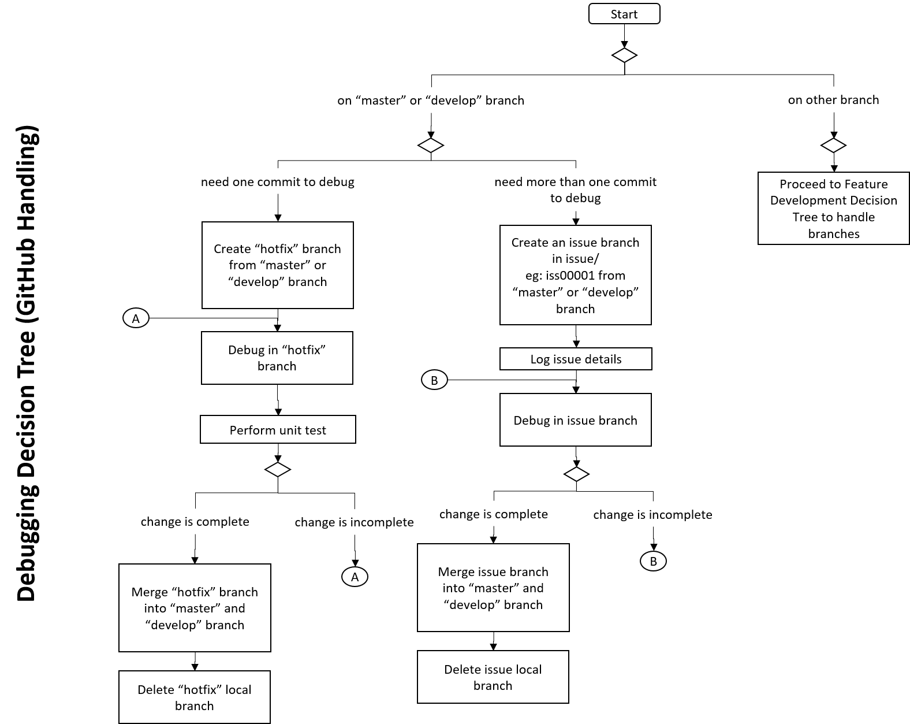

# Specs code
* 000: User account
* 001: Pre-operation resource nav tab
* 002: Pre-operation process nav tab
* 003: Pre-operation start nav tab
* 100: Intra-operation process control
* 101: Intra-operation step distribution
* 102: Intra-operation step execution
* 400: Background/offline processes

# Master branch handling
Develop branch can be merged into Master branch when:
* All features of that version has been developed and tested
* Project files works after cloning “develop” branch to a fresh PC
* Requirement.txt file has been updated
* Readme file has been updated

# Develop branch handling
Feature/issue/hotfix branch can be merged into Develop branch when:
* Unit testing has been done.
* No obvious and serious conflict is detectable.

# Feature branch handling
Feature branch can be created when:
* Feature specifications have been prepared.
* Data flow diagrams have been prepared.
* Files that will be affected are listed.

# Issue branch handling

