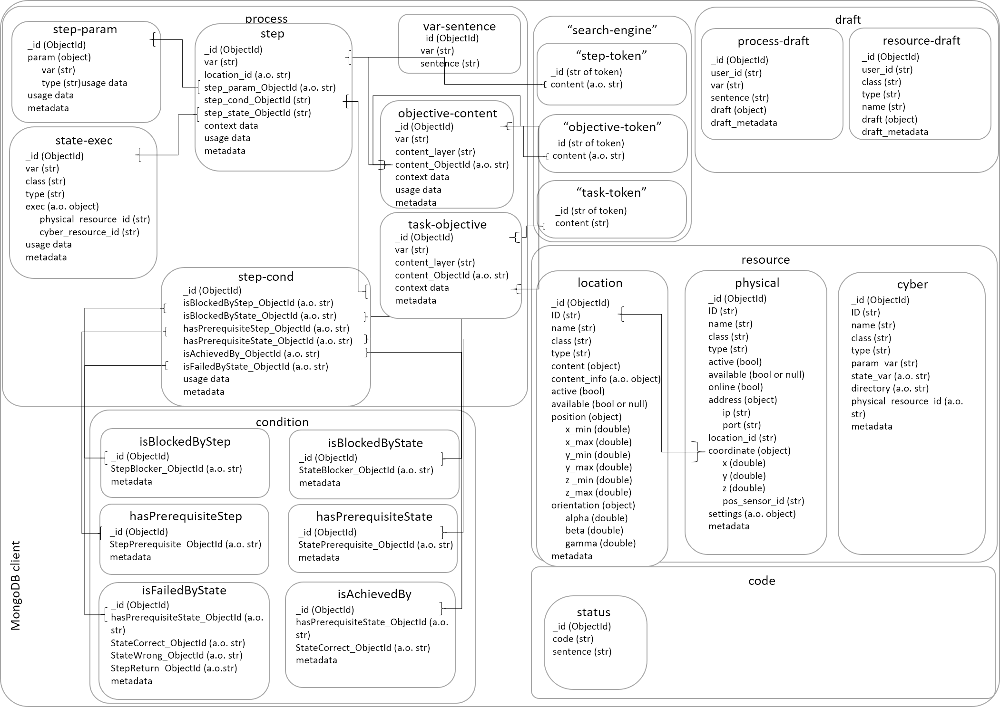

# Data Schema

## MongoDB
```
metadata = {
	"last_update": <datetime str>,
	"last_updated_by": <str>,
	"creation_timestamp": <datetime str>,
	"created_by": <str>
	}
```
```
usage_data = {
	"total_usage: <int>,
	"usage_in_task": <int>
	}
```
```
draft_metadata = {
	"creation_timestamp": <datetime str>,
	"creation_session": <object>,
	"last_update": <datetime str>,
	"last_update_session": <object>,
	"submission_timestamp": <datetime str>,
	"submission_session": <object>,
	"deletion_timestamp": <datetime str>,
	"deletion_session": <object>
}
```




## DB access


# Data Flow Diagram
When the ontology is involved, the ontology_details should be in this format:
```
ontology_details = {
	"task": {
		"sentence": <task_sentence>,
	},
	"objective": [
		{
			"sentence": <objective_sentence>,
			"layer": <N>,
			"content_layer": objective_layer_<N-1>,
			"content": <array of objective sentence>
		},
		...
		{
			"sentence": <step_sentence>,
			"layer": <N>,
			"content_layer": "step",
			"content": <array of step sentence>
		}
	],
	"step": [
		{
			"step": <step_sentence>,
			"location_id": <location_id>
		},
		...
	],
	"state": [
		{
			"var": <state_var>,
			"class": <state_class>,
			"type": <state_type>
			"exec": [
				{
					"class": <exec_class>,
					"type": <exec_type>,
					"cyber_resource_id": <cyber_resource_id>
				},
				...
			]
		},
		...
	],
	"isBlockedByStep": [
		{
			"step": <step_sentence>,
			"set_num": <set_num>,
			"StepBlocker": <array of step_sentence>
		},
		...
	],
	"hasPrerequisiteStep": [
		{
			"step": <step_sentence>,
			"set_num": <set_num>,
			"StepPrerequisite": <array of step_sentence>
		},
		...
	],
	"isBlockedByState": [
		{
			"step": <step_sentence>,
			"set_num": <set_num>,
			"StateBlocker": <array of state_var>
		},
		...
	],
	"hasPrerequisiteState": [
		{
			"step": <step_sentence>,
			"set_num": <set_num>,
			"StatePrerequisite": <array of state_var>
		},
		...
	],	
	"isAchievedBy": [
		{
			"step": <step_sentence>,
			"set_num": <set_num>,
			"hasPrerequisiteState": <array of hasPrerequisiteState indexes>,
			"StateCorrect": <array of state_var>
		},
		...
	],	
	"isFailedByState": [
		{
			"step": <step_sentence>,
			"set_num": <set_num>,
			"hasPrerequisiteState": <array of hasPrerequisiteState indexes>,
			"StateCorrect": <array of state_var>,
			"StateWrong": <array of state_var>
		},
		...
	],	
}
```
When a process is sent from the back-end, the process_details should be packaged in this format:
```
process_details = {
	"task": {
		"_id": <object id>,
		"var": <task_var>,
		"sentence": <task_sentence>,
		"content_layer": objective_layer_<N>,
		"content_ObjectId": <array of objective ids>
	},
	f"objective_layer_{N}": [
		{
			"_id": <ObjectId>,
			"sentence": <objective_sentence>,
			"var": <objective_var>,
			"content_layer": objective_layer_<N-1>,
			"content_ObjectId": <array of objective ids>
		},
		...
	],
	...
	f"objective_layer_1": [
		{
			"_id": <ObjectId>,
			"sentence": <objective_sentence>,
			"var": <objective_var>,
			"layer": objective_layer_<N>
			"content_layer": "step",
			"content_ObjectId": <array of step ids>
		},
		...
	],
	"step": [
		{
			"_id": <ObjectId>,
			"var": <step_var>,
			"sentence": <step_sentence>,
			"location_id": <array of location_ids>
			"state_exec_ObjectId": <array of ids>,
			"step_param_ObjectId": <array of ids>,
			"step_cond_ObjectId": <array of ids>,
		},
		...
	],
	"state": [
		{
			"_id": <ObjectId>,
			"var": <state_var>,
			"class": <state_class>,
			"type": <state_type>
			"exec": [
				{
					"physical_resource_id": <physical_resource_id>,
					"cyber_resource_id": <cyber_resource_id>
				},
				...
			]
		},
		...
	],
	"parameter": [
		{
			"_id": <ObjectId>,
			"param": {
				"var": <param_var>,
				"type": <param_datatype>			
			}
		},
		...
	],
	"condition": [
		{
			"_id": <ObjectId>,
			"isBlockedByStep_ObjectId": <array of ids>, 
			"hasPrerequisiteStep_ObjectId": <array of ids>,  
			"isBlockedByState_ObjectId": <array of ids>, 
			"hasPrerequisiteState_ObjectId": <array of ids>, 
			"isAchievedBy_ObjectId": <array of ids>, 
			"isFailedByState_ObjectId": <array of ids>, 
		}, 
		...
	],
	"isBlockedByStep": [
		{
			"_id": <ObjectId>,
			"StepBlocker_ObjectId": <array of step ids>
		},
		...
	],
	"hasPrerequisiteStep": [
		{
			"_id": <ObjectId>,
			"StepPrerequisite_ObjectId": <array of step ids>
		},
		...
	],
	"isBlockedByState": [
		{
			"_id": <ObjectId>,
			"StateBlocker_ObjectId": <array of state-exec ids>
		},
		...
	],
	"hasPrerequisiteState": [
		{
			"_id": <ObjectId>,
			"StatePrerequisite_ObjectId": <array of state-exec ids>
		},
		...
	],	
	"isAchievedBy": [
		{
			"_id": <ObjectId>,
			"hasPrerequisiteState_ObjectId": <array of hasPrerequisiteState ids>,
			"StateCorrect_ObjectId": <array of state-exec ids>
		},
		...
	],	
	"isFailedByState": [
		{
			"_id": <ObjectId>,
			"hasPrerequisiteState_ObjectId": <array of hasPrerequisiteState ids>,
			"StateCorrect_ObjectId": <array of state-exec ids>,
			"StateWrong_ObjectId": <array of state-exec ids>
		},
		...
	],	
}
```

When a process is sent from the front-end, the process_details should be packaged in this format:
```
process_details = {
	"task": {
		"_id": <object id> (if any),
		"index": <index>,
		"var": <task_var>,
		"sentence": <task_sentence>,
		"content_layer": objective_layer_<N>,
		"content_index": <array of objective indexes>
	},
	f"objective_layer_{N}": [
		{
			"_id": <object id> (if any),
			"index": <index>,
			"var": <objective_var>,
			"sentence": <objective_sentence>,
			"content_layer": objective_layer_<N-1>,
			"content_index": <array of objective indexes>
		},
		...
	],
	...
	f"objective_layer_1": [
		{
			"_id": <object id> (if any),
			"index": <index>,
			"var": <objective_var>,
			"sentence": <objective_sentence>,
			"content_layer": "step",
			"content_index": <array of step indexes>
		},
		...
	],
	"step": [
		{
			"_id": <object id> (if any),
			"index": <index>,
			"var": <step_var>,
			"sentence": <step_sentence>,
			"location_id": <array of location_ids>,
			"state_exec_index": <array of indexes>,
			"step_param_index": <array of indexes>,
			"step_cond_index": <array of indexes>,
		},
		...
	],
	"state": [
		{
			"_id": <object id> (if any),
			"index": <index>,
			"var": <state_var>,
			"class": <state_class>,
			"type": <state_type>
			"exec": [
				{
					"physical_resource_id": <physical_resource_id>,
					"cyber_resource_id": <cyber_resource_id>
				},
				...
			]
		},
		...
	],
	"parameter": [
		{
			"_id": <object id> (if any),
			"index": <index>,
			"var": <param_var>,
			"type": <param_datatype>
		},
		...
	],
	"condition": [
		{
			"_id": <object id> (if any),
			"index": <index>,
			"isBlockedByStep_index": <array of indexes>, 
			"hasPrerequisiteStep_index": <array of indexes>, 
			"isBlockedByState_index": <array of indexes>, 
			"hasPrerequisiteState_index": <array of indexes>, 
			"isAchievedBy_index": <array of indexes>, 
			"isFailedByState_index": <array of indexes>, 
		},
		...
	],
	"isBlockedByStep": [
		{
			"_id": <object id> (if any),
			"index": <index>,
			"StepBlocker_index": <array of step indexes>
		},
		...
	],
	"hasPrerequisiteStep": [
		{
			"_id": <ObjectId> (if any),
			"index": <index>,
			"StepPrerequisite_index": <array of step indexes>
		},
		...
	],
	"isBlockedByState": [
		{
			"_id": <ObjectId> (if any),
			"index": <index>,
			"StateBlocker_index": <array of state-exec indexes>
		},
		...
	],
	"hasPrerequisiteState": [
		{
			"_id": <ObjectId> (if any),
			"index": <index>,
			"StatePrerequisite_index": <array of state-exec indexes>
		},
		...
	],	
	"isAchievedBy": [
		{
			"_id": <ObjectId> (if any),
			"index": <index>,
			"hasPrerequisiteState_index": <array of hasPrerequisiteState indexes>,
			"StateCorrect_index": <array of state-exec indexes>
		},
		...
	],	
	"isFailedByState": [
		{
			"_id": <ObjectId> (if any),
			"index": <index>,
			"hasPrerequisiteState_index": <array of hasPrerequisiteState indexes>,
			"StateCorrect_index": <array of state-exec indexes>,
			"StateWrong_index": <array of state-exec indexes>
		},
		...
	],	
}
```


When a process_detail is sent from the back-end for job tab, the process_detail has the same format as above except for step component:
```
process_detail = {
	...,
	"step": [
		{
			"_id": <object id> (if any),
			"index": <index>,
			"var": <step_var>,
			"sentence": <step_sentence>,
			"location_id": <array of location_ids>,
			"param": [ <array of possible param for one selection>
				{
					"var": <param_var>,
					"type": <param_type>,
				},
				...
			],
			"exec": [
				{
					"index": <index>,
					"same_as_step_index": None,
					"same_as_exec_index": None,
					"state": {
						"class": <state_class>,
						"type": <state_type>
					},
					"preferred_exec": [<array of possible exec dictionary for one selection>
						{
							"physical_resource_id": <physical_resource id>,
							"physical_resource_class": <physical_resource class>,
							"physical_resource_type": <physical_resource type>,
							"physical_resource_name": <physical_resource name>,
							"cyber_resource_id": <cyber_resource_id of physical_resource>,
							"cyber_resource_class": <cyber_resource_class>,
							"cyber_resource_type": <cyber_resource_type>,
							"cyber_resource_name": <cyber_resource_name>,
						},
						...
					],
					"alternative_exec": [<array of possible exec dictionary for multiple selections>
						{
							"physical_resource_id": <physical_resource id>,
							"physical_resource_class": <physical_resource class>,
							"physical_resource_type": <physical_resource type>,
							"physical_resource_name": <physical_resource name>,
							"cyber_resource_id": <cyber_resource_id of physical_resource>,
							"cyber_resource_class": <cyber_resource_class>,
							"cyber_resource_type": <cyber_resource_type>,
							"cyber_resource_name": <cyber_resource_name>,
						},
						...
					],
				},
				...
			],
			"state_exec_index": <array of indexes>,
			"step_cond_index": <array of indexes>,
		},
		...
	],
```

When a job is sent from the front-end, the job_details is a list of process_details.
The process details has the same format as above except step component. The format for step_component is as follows:
```
job_details = [
	{
		...,
		"step": [
			{
				"_id": <object id> (if any),
				"index": <index>,
				"var": <step_var>,
				"sentence": <step_sentence>,
				"location_id": <array of location_ids>,
				"param": {
					"_id": <object id> (if any),
					"var": <param_var>,
					"type": <param_type>,
				},
				"exec": [
					{
						"index": <index>,
						"same_as_step_index": <step_index>,
						"same_as_exec_index": <exec_index within same step dict>,
						"state": {
							"class": <state_class>,
							"type": <state_type>
						},
						"preferred_exec": {<(one physical_resource selected from possible_exec_list) OR (None if same_as_exec_index is not None)>
							"physical_resource_id": <physical_resource id>,
							"physical_resource_class": <physical_resource class>,
							"physical_resource_type": <physical_resource type>,
							"physical_resource_name": <physical_resource name>,
							"cyber_resource_id": <cyber_resource_id of physical_resource>,
							"cyber_resource_class": <cyber_resource_class>,
							"cyber_resource_type": <cyber_resource_type>,
							"cyber_resource_name": <cyber_resource_name>,
						},
						"alternative_exec": [<(array of physical_resource selected from possible_exec_list) OR (None if same_as_exec_index is not None)>
							{
								"physical_resource_id": <physical_resource id>,
								"physical_resource_class": <physical_resource class>,
								"physical_resource_type": <physical_resource type>,
								"physical_resource_name": <physical_resource name>,
								"cyber_resource_id": <cyber_resource_id of physical_resource>,
								"cyber_resource_class": <cyber_resource_class>,
								"cyber_resource_type": <cyber_resource_type>,
								"cyber_resource_name": <cyber_resource_name>,
							},
							...
						],
					},
					...
				],
				"state_exec_index": <array of indexes>,
				"step_cond_index": <array of indexes>,
			},
			...
		],
	},
	...
]

```


## Front-end and Back-end Communication


## Step broadcast


