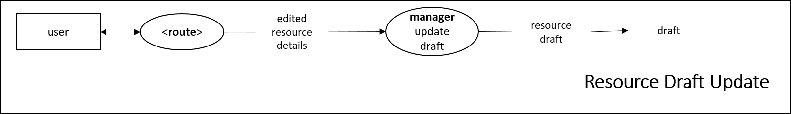

> Disclaimer:
> These specification templates are modified by Elena in reference to [Copyright © 2003-2004 Jason Robbins](https://scm.opendap.org/svn/trunk/rsg/AIS/templates/srs.html).

# Code 001
This sheet refers to use cases that is associated with resource handling under resource navigation tab.

# Use Case Specifications

## Template
Use case code: UC-00  
Use case name: Event  
Priority: Essential | Expected | Desired | Optional  
Use frequency: Once | Rarely | Sometimes | Often | Always  
Success scenario: STEP(S)  
Notes and Questions:  

## UC-00100: Add new location
Priority: Essential  
Use frequency: Rarely  
Success scenario: STEP(S)  
Notes and Questions:  
  

## UC-00101: Save as draft for location/hardware/robot/software entry
Priority: Desired   
Use frequency: Often  
Success scenario: STEP(S)  
Notes and Questions:  
  

## UC-00102: Submit location/hardware/robot/software
Priority: Essential   
Use frequency: Sometimes  
Success scenario: STEP(S)  
Notes and Questions:  
  

## UC-00103: Edit location/hardware/robot/software
Priority: Essential  
Use frequency: Often  
Success scenario: STEP(S)  
Notes and Questions:  
  

## UC-00104: Delete location/hardware/robot/software
Priority: Essential 
Use frequency: Often  
Success scenario: STEP(S)  
Notes and Questions:  
  

## UC-00105: Add new human
Priority: Expected  
Use frequency: Rarely   
Success scenario: STEP(S)  
Notes and Questions:  
  

## UC-00106: Save as draft for human entry
Priority: Desired  
Use frequency: Often  
Success scenario: STEP(S)  
Notes and Questions:  
  

## UC-00107: Submit human
Priority: Essential  
Use frequency: Sometimes  
Success scenario: STEP(S)  
Notes and Questions:  
  

## UC-00108: Edit human
Priority: Expected  
Use frequency: Sometimes  
Success scenario: STEP(S)  
Notes and Questions:  
  

## UC-00109: Delete human
Priority: Expected  
Use frequency: Rarely  
Success scenario: STEP(S)  
Notes and Questions:  
  

## UC-00110: Update resource draft
Priority: Desired  
Use frequency: Often  
Success scenario: STEP(S)  
Notes and Questions:  
  

## UC-00111: Discard resource draft
Priority: Desired  
Use frequency: Often  
Success scenario: STEP(S)  
Notes and Questions:  
  

## UC-00112: Duplicate resource draft
Priority: Desired  
Use frequency: Often  
Success scenario: STEP(S)  
Notes and Questions:  
  

# Feature Specifications 

## Template
Feature code: F-00  
Feature name: Feature  
Priority: Essential | Expected | Desired | Optional  
Effort: Months | Weeks | Days | Hours  
Risk: Dangerous | 3-Risks | 2-Risks | 1-Risk | Safe  
Functional area (s): Initialization | Planning | Execution | Guidance | Inspection | Communication | Data Collection | Data Analysis  
Use case (s): Use case code  
Description: CONSTRAINT(S) / CHART(S) / DIAGRAM(S)  
Notes and Questions:  

# Issue Specifications 

## Template
Issue code: Iss-00  
Issue name: Feature  
Priority: Essential | Expected | Desired | Optional  
Effort: Months | Weeks | Days | Hours  
Risk: Dangerous | 3-Risks | 2-Risks | 1-Risk | Safe  
Affected area (s): Initialization | Planning | Execution | Guidance | Inspection | Communication | Data Collection | Data Analysis  
Description: CONSTRAINT(S) / CHART(S) / DIAGRAM(S)  
Solution: STEP  
Notes and Questions:  
