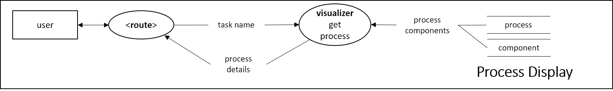

> Disclaimer:
> These specification templates are modified by Elena in reference to [Copyright © 2003-2004 Jason Robbins](https://scm.opendap.org/svn/trunk/rsg/AIS/templates/srs.html).

# Code 002
This sheet refers to use cases that is associated with process handling under process navigation tab.

# Use Case Specifications

## Template
Use case code: UC-00  
Use case name: Event  
Priority: Essential | Expected | Desired | Optional  
Use frequency: Once | Rarely | Sometimes | Often | Always  
Success scenario: STEP(S)  
Notes and Questions:  

## UC-00200: Configure process
Priority: Essential  
Use frequency: Always  
Success scenario: 
1. User is able to include all possible configurations for the task to be completed.  
2. Possible configurations are suggested to the user.
3. Conflicts are shown to the user.
4. Similar configurations that may be relevant are suggested to the user.
Notes and Questions:  
  

## UC-00201: Save as draft for process
Priority: Desired  
Use frequency: Often  
Success scenario: STEP(S)  
Notes and Questions:  
  

## UC-00202: Submit process
Priority: Essential  
Use frequency: Always  
Success scenario: STEP(S)  
Notes and Questions:  
  

## UC-00203: Edit process
Priority: Essential  
Use frequency: Sometimes  
Success scenario: STEP(S)  
Notes and Questions:  
  

## UC-00204: Delete process
Priority: Expected  
Use frequency: Sometimes  
Success scenario: STEP(S)  
Notes and Questions:  
  

## UC-00205: View process
Priority: Essential  
Use frequency: Always  
Success scenario: STEP(S)  
Notes and Questions:  
  

## UC-00206: Import excel ontology
Priority: Optional  
Use frequency: Often 
Success scenario: STEP(S)  
Notes and Questions:  
  

## UC-00207: Export excel ontology
Priority: Optional  
Use frequency: Rarely
Success scenario: STEP(S)  
Notes and Questions:  
  

## UC-00208: Update process draft
Priority: Desired  
Use frequency: Often  
Success scenario: STEP(S)  
Notes and Questions:  
  

## UC-00209: Discard process draft
Priority: Desired  
Use frequency: Often  
Success scenario: STEP(S)  
Notes and Questions:  
  

## UC-00210: Duplicate process draft
Priority: Desired  
Use frequency: Often  
Success scenario: STEP(S)  
Notes and Questions:  
  

# Feature Specifications 

## Template
Feature code: F-00  
Feature name: Feature  
Priority: Essential | Expected | Desired | Optional  
Effort: Months | Weeks | Days | Hours  
Risk: Dangerous | 3-Risks | 2-Risks | 1-Risk | Safe  
Functional area (s): Initialization | Planning | Execution | Guidance | Inspection | Communication | Data Collection | Data Analysis  
Use case (s): Use case code  
Description: CONSTRAINT(S) / CHART(S) / DIAGRAM(S)  
Notes and Questions:  

## F-00200: Update process db and condition db
Priority: Essential  
Effort: Days  
Risk: Dangerous  
Functional area (s): Initialization & Planning  
Use case (s): UC-00203  
Description: CONSTRAINT(S) / CHART(S) / DIAGRAM(S)  
* Obsolete process items will not be removed/updated directly. Instead, whenever there is a change in details/contents, new process item docs are created.  
* The obsolete process items will be archived (logical deletion) by the TrashCollector module. This reduces the risk of accidentally removing docs that are being used in another process.  
* Flow chart when task_update event is triggered. Bolded fonts are the functions.  
  
Notes and Questions:  

# Issue Specifications 

## Template
Issue code: Iss-00  
Issue name: Feature  
Priority: Essential | Expected | Desired | Optional  
Effort: Months | Weeks | Days | Hours  
Risk: Dangerous | 3-Risks | 2-Risks | 1-Risk | Safe  
Affected area (s): Initialization | Planning | Execution | Guidance | Inspection | Communication | Data Collection | Data Analysis  
Description: CONSTRAINT(S) / CHART(S) / DIAGRAM(S)  
Solution: STEP  
Notes and Questions:  
