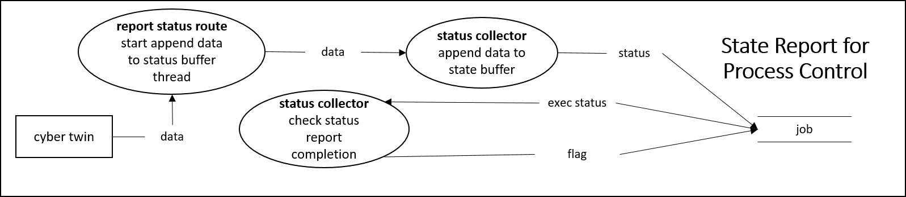
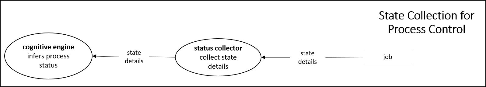
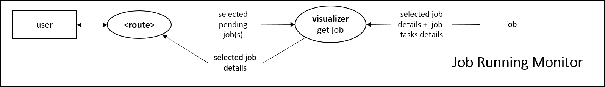

> Disclaimer:
> These specification templates are modified by Elena in reference to [Copyright © 2003-2004 Jason Robbins](https://scm.opendap.org/svn/trunk/rsg/AIS/templates/srs.html).

# Code 100
This sheet refers to use cases that is associated with process control.

# Use Case Specifications

## Template
Use case code: UC-00  
Use case name: Event  
Priority: Essential | Expected | Desired | Optional  
Use frequency: Once | Rarely | Sometimes | Often | Always  
Success scenario: STEP(S)  
Notes and Questions:  

## UC-10000: Report state
Priority: Essential  
Use frequency: Always  
Success scenario: STEP(S)  
Notes and Questions:  
  

## UC-10001: Collect state
Priority: Essential  
Use frequency: Always  
Success scenario: STEP(S)  
Notes and Questions:  
  

## UC-10002: Broadcast step
Priority: Essential  
Use frequency: Always  
Success scenario: STEP(S)  
Notes and Questions:  
  

## UC-10003: Monitor running jobs
Priority: Expected  
Use frequency: Sometimes  
Success scenario: STEP(S)  
Notes and Questions:  
  

# Feature Specifications 

## Template
Feature code: F-00  
Feature name: Feature  
Priority: Essential | Expected | Desired | Optional  
Effort: Months | Weeks | Days | Hours  
Risk: Dangerous | 3-Risks | 2-Risks | 1-Risk | Safe  
Functional area (s): Initialization | Planning | Execution | Guidance | Inspection | Communication | Data Collection | Data Analysis  
Use case (s): Use case code  
Description: CONSTRAINT(S) / CHART(S) / DIAGRAM(S)  
Notes and Questions:  

# Issue Specifications 

## Template
Issue code: Iss-00  
Issue name: Feature  
Priority: Essential | Expected | Desired | Optional  
Effort: Months | Weeks | Days | Hours  
Risk: Dangerous | 3-Risks | 2-Risks | 1-Risk | Safe  
Affected area (s): Initialization | Planning | Execution | Guidance | Inspection | Communication | Data Collection | Data Analysis  
Description: CONSTRAINT(S) / CHART(S) / DIAGRAM(S)  
Solution: STEP  
Notes and Questions:  
